# Architecture

Self-Correcting Enterprise RAG & Hybrid Text-to-SQL with HITL — how the pieces
fit together. Each diagram is shown as a rendered PNG; the
[Mermaid](https://mermaid.js.org/) source is in a collapsible block beneath it,
and crisp SVG versions live in [`images/`](images/). Regenerate the images with
the Mermaid CLI (`npx @mermaid-js/mermaid-cli -i <file>.mmd -o <out>`).

- [1. System architecture (components)](#1-system-architecture-components)
- [2. Request lifecycle (end to end)](#2-request-lifecycle-end-to-end)
- [3. CRAG document loop (LangGraph)](#3-crag-document-loop-langgraph)
- [4. Text-to-SQL + HITL gate (LangGraph)](#4-text-to-sql--hitl-gate-langgraph)
- [5. Ingestion pipeline](#5-ingestion-pipeline)
- [6. Observability topology](#6-observability-topology)
- [Module map](#module-map)

---

## 1. System architecture (components)

The whole system is local. Entry is either the CLI or the FastAPI service; both
call the single `answer_question` entry point, which is wrapped by the guardrail
firewall and then routes to one of two LangGraph state machines. A provider
facade (`llm.py`) is the only thing that talks to an LLM/embedding backend, so
Ollama and Azure are interchangeable.

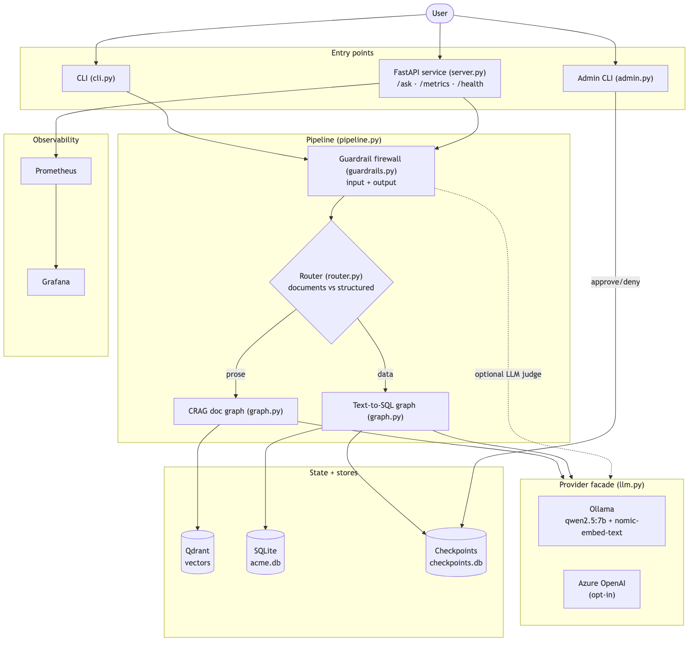

Mermaid source

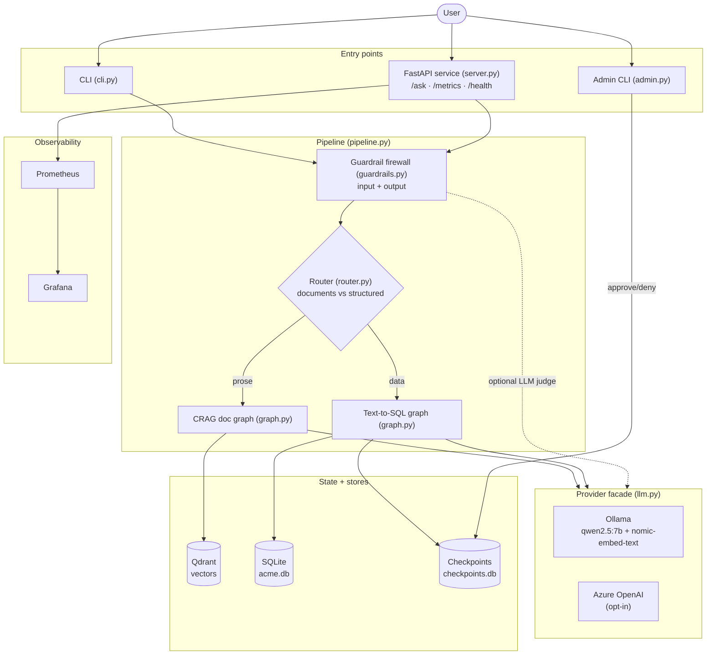

---

## 2. Request lifecycle (end to end)

A single `/ask` (or CLI question), from input firewall to scrubbed answer. The
router decides which branch runs; the other is skipped.

Mermaid source

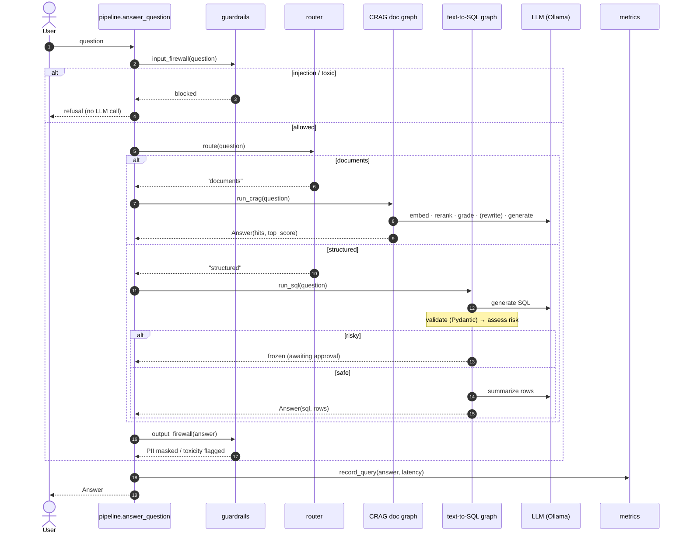

---

## 3. CRAG document loop (LangGraph)

The self-correcting retrieval loop (Milestone 4). Grading is two-tier: a fast
score pre-gate, then an LLM judge. A weak grade rewrites the query and retries
(bounded by `CRAG_MAX_REWRITES`).

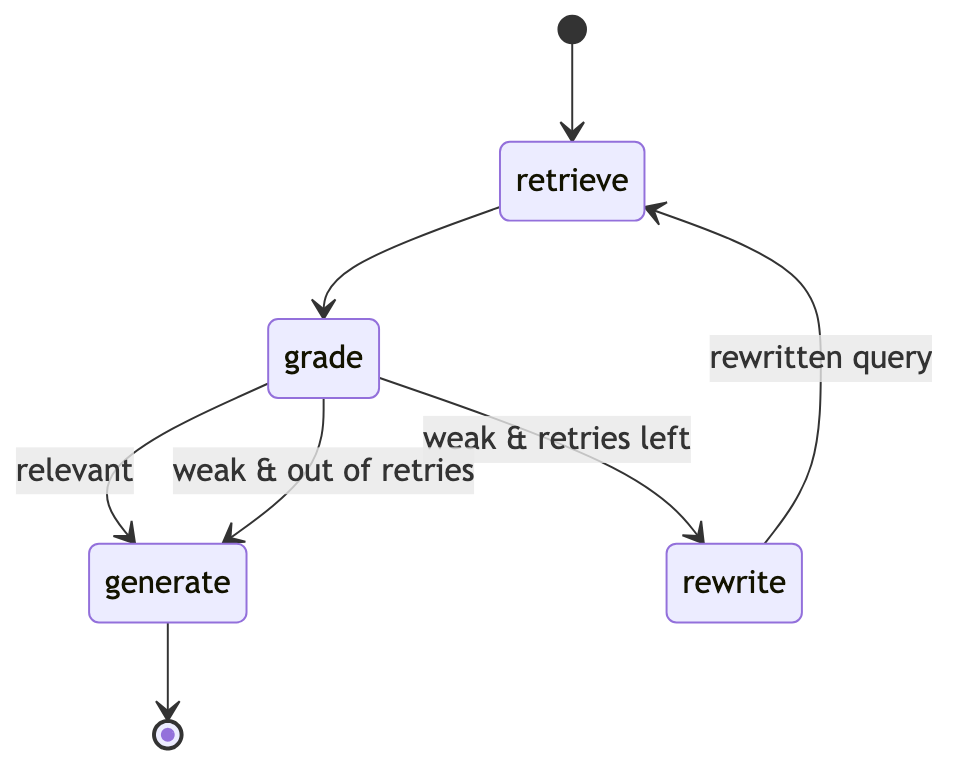

Mermaid source

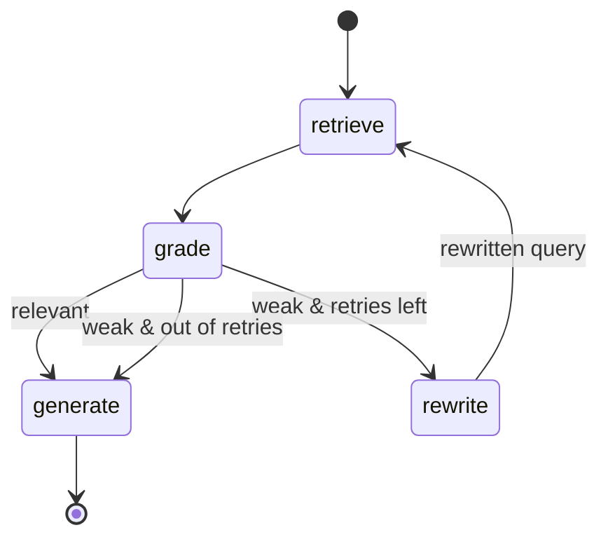

---

## 4. Text-to-SQL + HITL gate (LangGraph)

The structured branch (Milestones 5–6). SQL is validated into a read-only
`SQLQuery`, risk-assessed, and — if risky — frozen via a durable `interrupt()`
until an admin resumes it from the checkpoint.

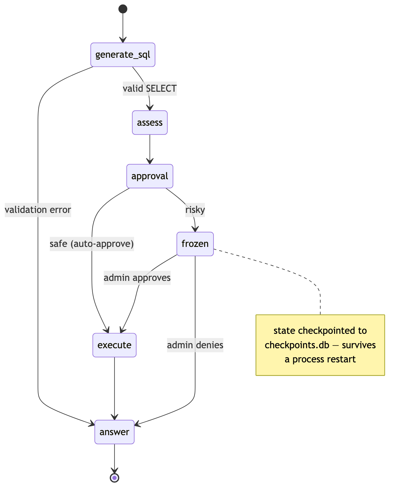

Mermaid source

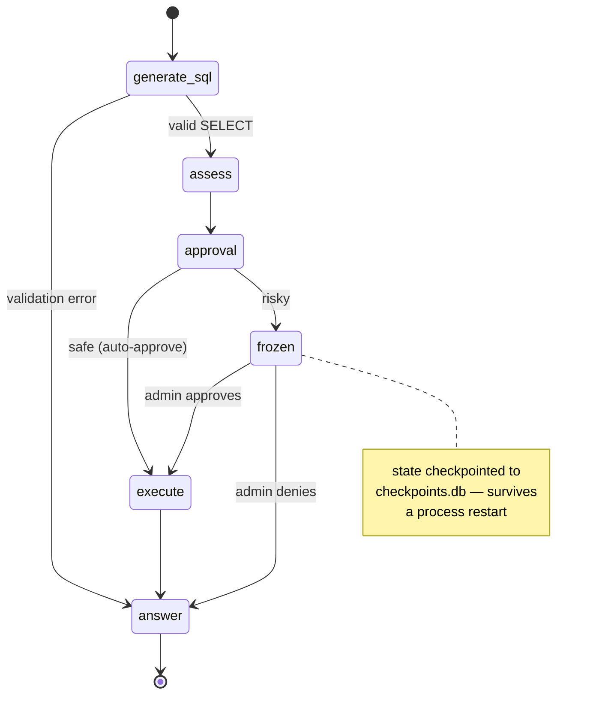

---

## 5. Ingestion pipeline

Offline, run before querying (`python -m src.rag.ingest`). Documents become
parent-child chunks, embedded and upserted into Qdrant; the collection is stamped
with an embedder fingerprint so a later mismatched query fails loudly.

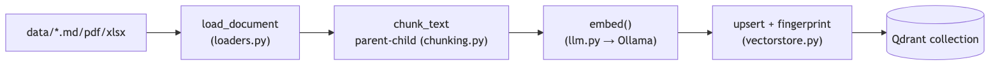

Mermaid source

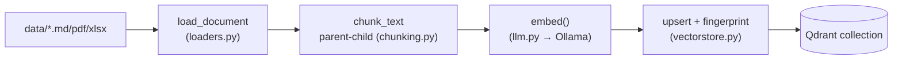

---

## 6. Observability topology

The app runs on the **host** (uvicorn, `:8000`); the monitoring stack runs in
**Docker**. Prometheus scrapes the host via `host.docker.internal`. Eval scores
reach Prometheus without a pushgateway: `eval.py` writes a JSON report, and a
custom collector on `/metrics` reads it at scrape time.

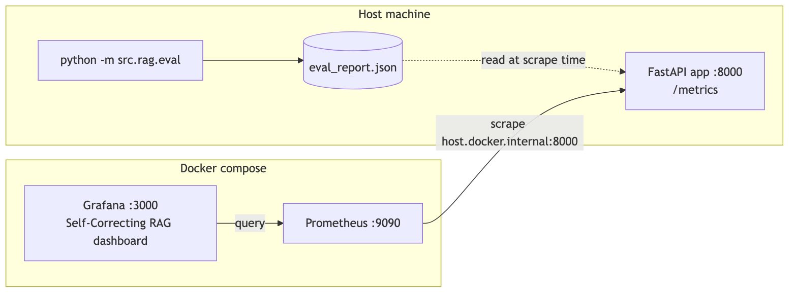

Mermaid source

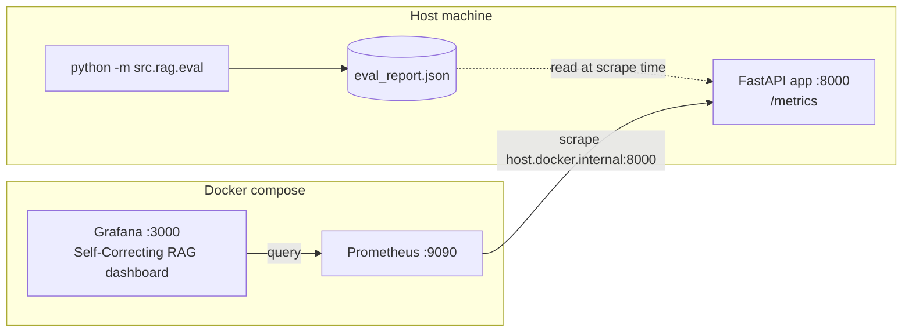

---

## Module map

| Module | Responsibility | Milestone |
|--------|----------------|-----------|
| `config.py` | Env-driven settings (single source of truth) | M1 |
| `llm.py` | Provider facade — only place that calls `embed()`/`chat()` | M1.5 |
| `ollama_client.py` / `azure_client.py` | Local / cloud LLM backends | M1 / M1.5 |
| `loaders.py` | PDF / XLSX / MD → text | M1 |
| `chunking.py` | Recursive splitter → parent-child chunks | M1 / M2 |
| `vectorstore.py` | Qdrant: collection, upsert, search, embedder fingerprint | M1 / M1.5 |
| `reranker.py` | BGE cross-encoder reranking | M3 |
| `ingest.py` | Ingestion CLI | M1 |
| `grader.py` | CRAG retrieval grading (score pre-gate + LLM judge) | M4 |
| `router.py` | Documents-vs-structured routing | M5 |
| `text_to_sql.py` | LLM → validated read-only `SQLQuery` (Pydantic) | M5 |
| `database.py` | SQLite: schema DDL + read-only `run_select` | M5 |
| `seed_db.py` | Build `data/acme.db` employees table | M5 |
| `risk.py` | SQL risk policy (sensitive columns + broad scans) | M6 |
| `approvals.py` | Persistent registry of frozen queries | M6 |
| `admin.py` | Approve/deny frozen SQL (CLI) | M6 |
| `guardrails.py` | I/O firewall: injection / PII / toxicity | M7 |
| `graph.py` | LangGraph: CRAG loop + text-to-SQL + HITL gate | M4–M6 |
| `pipeline.py` | `answer_question` = input guard → route → core → output guard | M1–M7 |
| `eval.py` | Local Ragas-style quality eval | M8 |
| `metrics.py` | Prometheus runtime metrics + eval-score collector | M8 |
| `server.py` | FastAPI `/ask` `/metrics` `/health` | M8 |
| `cli.py` | Interactive/one-shot question CLI | M1 |
